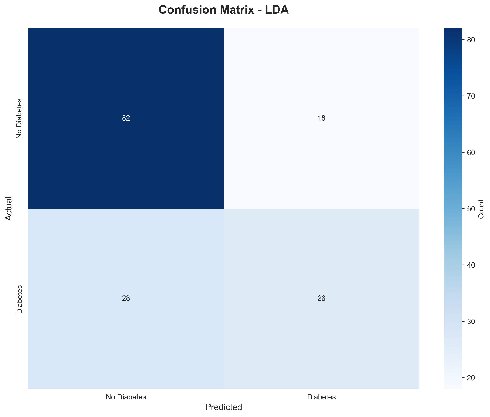

# 🩺 Diabetes Prediction using Classical Machine Learning

An end-to-end machine learning project that predicts the onset of diabetes using classical supervised learning techniques.  
This project compares **Logistic Regression** and **Linear Discriminant Analysis (LDA)** on real medical data and focuses on **model evaluation, interpretability, and reproducibility**.

---

## 📌 Project Overview

Diabetes is a chronic disease that requires early detection for effective treatment and management.  
This project leverages medical diagnostic data to build and compare two classical machine learning models for predicting diabetes risk.

The emphasis of this project is not only on accuracy, but also on **medical relevance**, **interpretability**, and **proper evaluation**, making it suitable for academic submission and real-world understanding.

---

## 📊 Dataset

- **Name:** Pima Indians Diabetes Dataset  
- **Source:** Kaggle (UCI Machine Learning Repository)  
- **Records:** 768  
- **Features:** 8 medical attributes  
- **Target:** Binary outcome (Diabetic / Non-Diabetic)

> ⚠️ The dataset is not included in the repository.  
> Please download it from Kaggle and place it inside `data/diabetes.csv`.

---

## 🧠 Models Implemented

- **Logistic Regression**
- **Linear Discriminant Analysis (LDA)**

Both models are trained on standardized data and evaluated using multiple performance metrics.

---

## ⚙️ Project Workflow

1. **Dataset Loading**
2. **Exploratory Data Analysis (EDA)**
   - Feature distributions
   - Class imbalance
   - Correlation analysis
3. **Data Cleaning & Preprocessing**
   - Handling invalid zero values
   - Median imputation
   - Feature scaling
4. **Model Training**
   - Logistic Regression
   - LDA
5. **Model Evaluation**
   - Confusion Matrix
   - Accuracy, Precision, Recall, F1-Score
   - ROC Curve & AUC
6. **Model Interpretation**
   - Feature importance using Logistic Regression coefficients
7. **Conclusion & Future Scope**
8. **(Bonus)** Streamlit Web App

---

## 📈 Evaluation Metrics

The models are evaluated using:

- Accuracy
- Precision
- Recall *(critical for medical diagnosis)*
- F1-Score
- ROC Curve & AUC

> Special focus is given to **Recall**, as false negatives in diabetes prediction can delay medical treatment.

---

## 🔍 Key Insights

- **Glucose** is the strongest predictor of diabetes, aligning with medical understanding.
- **BMI** and **Age** also show significant influence on diabetes risk.
- Logistic Regression achieved slightly better recall compared to LDA, making it more suitable for healthcare applications.

---

## 🛠️ Technologies Used

- **Python**
- **Pandas, NumPy**
- **Scikit-learn**
- **Matplotlib, Seaborn**
- **Jupyter Notebook**
- **Streamlit** (for UI – optional)

---

## 📂 Project Structure
```
Diabetes-Prediction-Using-ML/
├── diabetes_prediction.ipynb
├── preprocessing.py
├── eda_analysis.py
├── model_training.py
├── evaluate_models.py
├── extract_coefficients.py
├── requirements.txt
├── README.md
├── data/
├── outputs/
│   ├── confusion_matrices/
│   └── roc_curves/
└── report/
    └── Diabetes_Prediction_Report.pdf
```
---

## ▶️ How to Run the Project

### 1️⃣ Clone the Repository
```bash
git clone https://github.com/your-username/Diabetes-Prediction-Using-ML.git
cd Diabetes-Prediction-Using-ML
```
### 2️⃣ Install Dependencies
```bash
pip install -r requirements.txt
```
### 3️⃣ Run the Notebook

```bash
jupyter notebook diabetes_prediction.ipynb
```
### (Optional) Run Streamlit App
```bash
streamlit run app.py
```
## 📊 Model Evaluation Visuals

### 🔹 Confusion Matrices
<p align="center">
  
  
</p>

### 🔹 ROC Curve Comparison
<p align="center">
  
</p>

---


## 📌 Results Summary

- **Logistic Regression** demonstrated better recall, making it safer for medical diagnosis where minimizing false negatives is critical.
- **Linear Discriminant Analysis (LDA)** provided competitive performance with simpler statistical assumptions.
- Proper **data preprocessing** (handling missing/invalid values and scaling) significantly improved overall model reliability.

---

## 🚀 Future Improvements

- Apply advanced machine learning models such as **Random Forest** and **XGBoost**
- Add **cross-validation** for more robust performance evaluation
- Deploy the model as a **real-time medical decision support system**
- Train on **larger and more diverse medical datasets** to improve generalization

---

## 👩‍💻 Author

**Samiksha Vishwanath Wanjari**  
B.Tech Student | Data Science & Machine Learning  
IIT Guwahati – Certified Program

---

## ⭐ Acknowledgements

- Kaggle & UCI Machine Learning Repository  
- Scikit-learn Documentation  
- IIT Guwahati Data Science Program
